# 01 - Pengantar

## Tujuan Pembelajaran

1. (bisa copy dari RPS kolom sub-CP-MK)
2. dst

## Hasil Praktikum

1. 
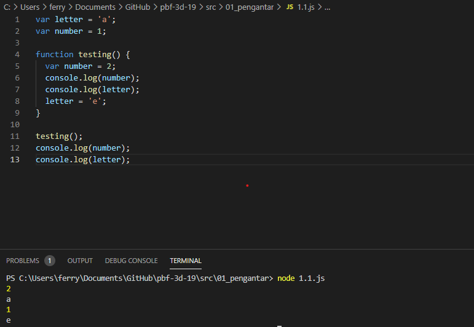

[link](../../src/01_pengantar/1.1.js)  

2. 
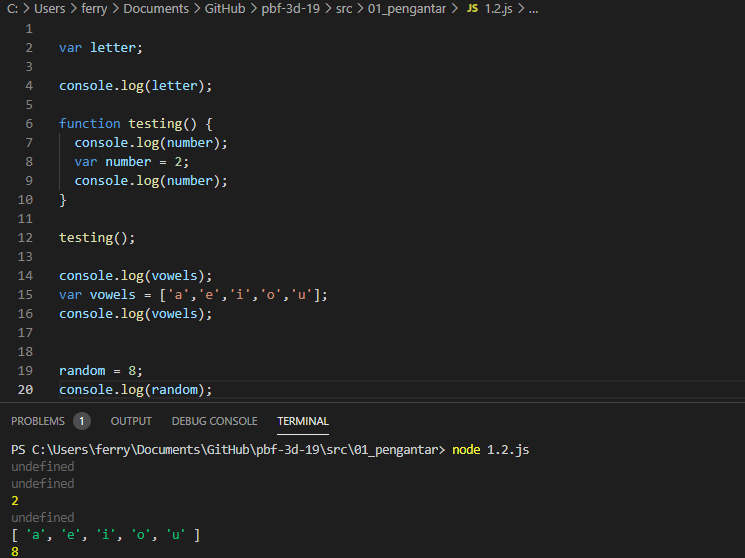

[link](../../src/01_pengantar/1.2.js)  

3. 
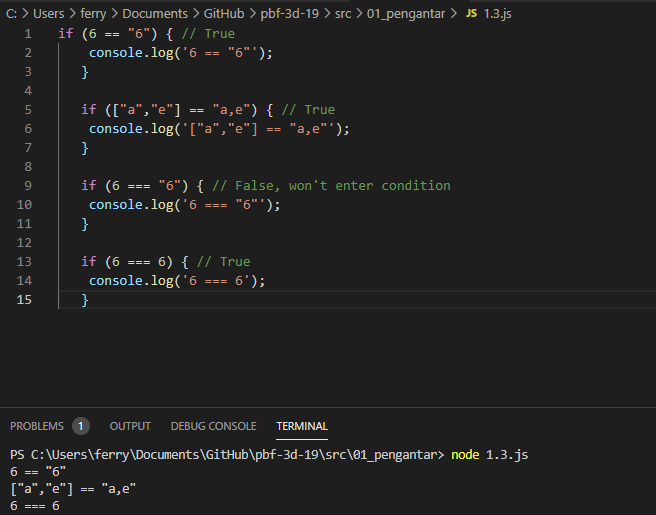

[link](../../src/01_pengantar/1.3.js)  

4. 

[link](../../src/01_pengantar/1.4.js)  

5. 
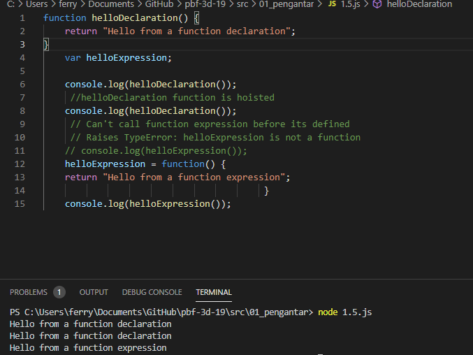

[link](../../src/01_pengantar/1.5.js)  

6. 
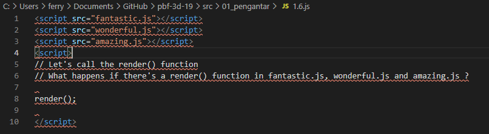

[link](../../src/01_pengantar/1.6.js)  

7. 
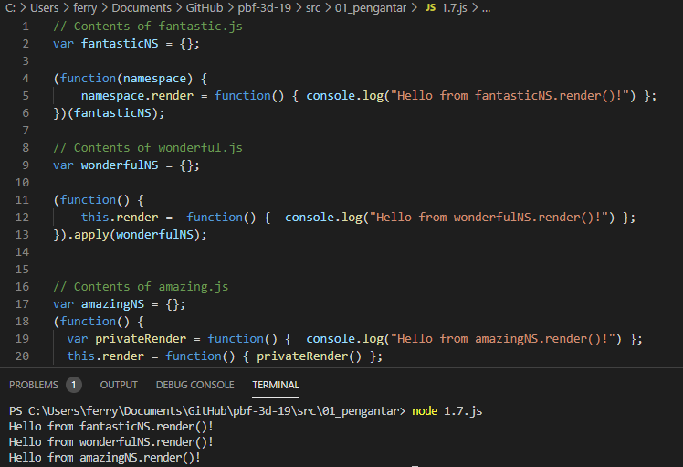

[link](../../src/01_pengantar/1.7.js)  

8. 

[link](../../src/01_pengantar/1.8.js)  

9. 
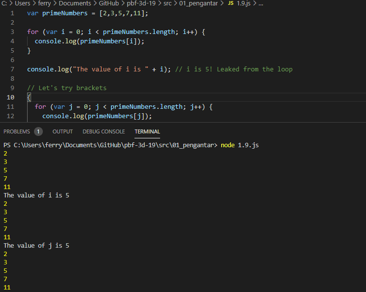

[link](../../src/01_pengantar/1.9.js)  

10. 

[link](../../src/01_pengantar/1.10.js)  

11. 
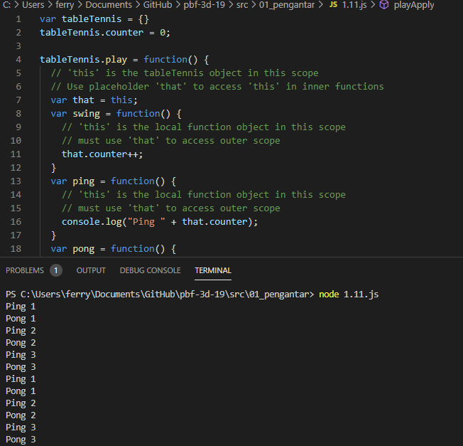

[link](../../src/01_pengantar/1.11.js)  

12. 
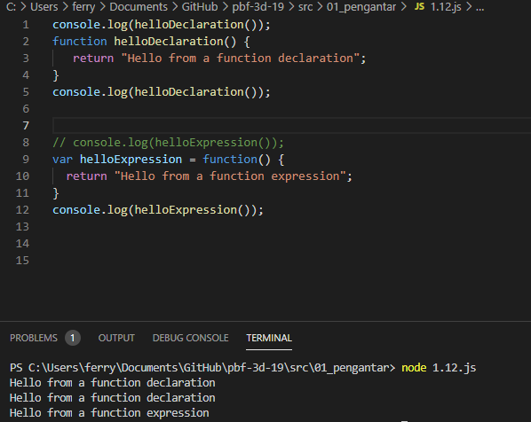

[link](../../src/01_pengantar/1.12.js)  

13. 
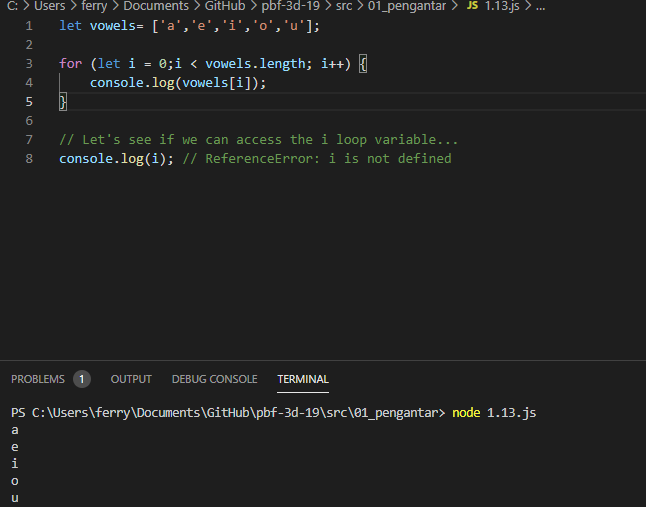

[link](../../src/01_pengantar/1.13.js)  

14. 
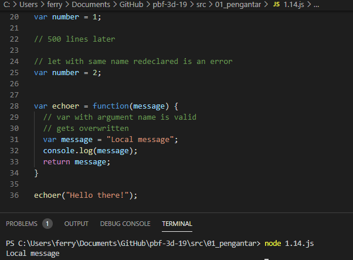

[link](../../src/01_pengantar/1.14.js)  

15. 
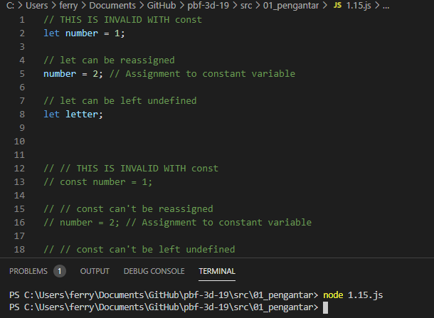

[link](../../src/01_pengantar/1.15.js)  

16. 

[link](../../src/01_pengantar/1.16.js)  

17. 

[link](../../src/01_pengantar/1.17.js)  

18. 
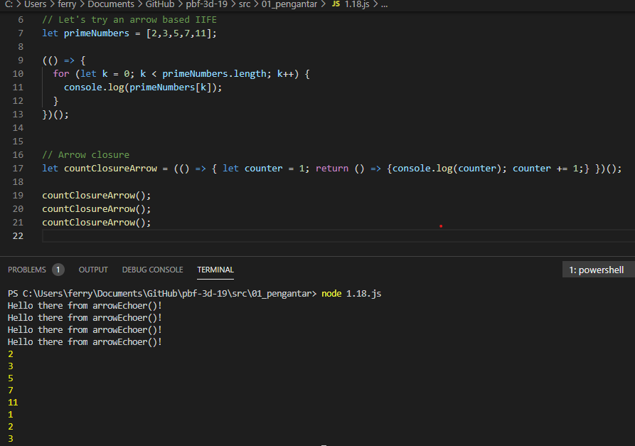

[link](../../src/01_pengantar/1.18.js)  

19. 
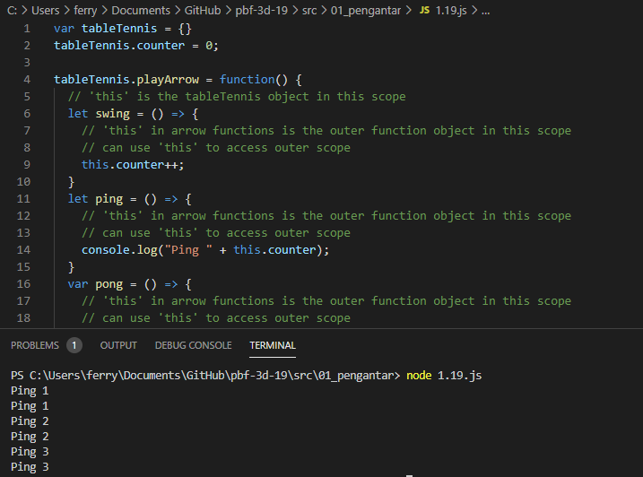

[link](../../src/01_pengantar/1.19.js)  

20. 

[link](../../src/01_pengantar/1.20.js)  

21. 
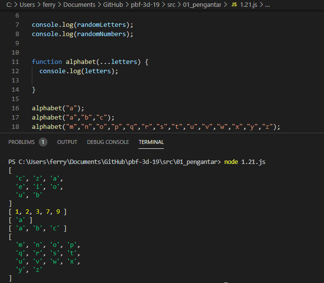

[link](../../src/01_pengantar/1.21.js)  

22. 
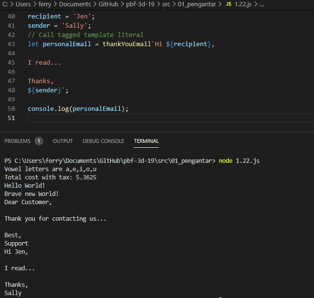

[link](../../src/01_pengantar/1.22.js)  