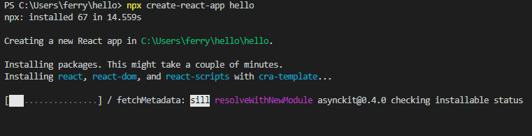
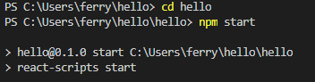
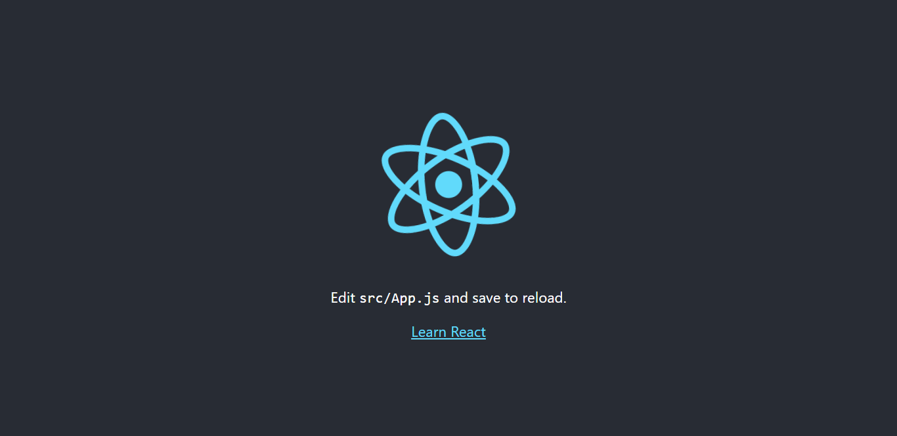
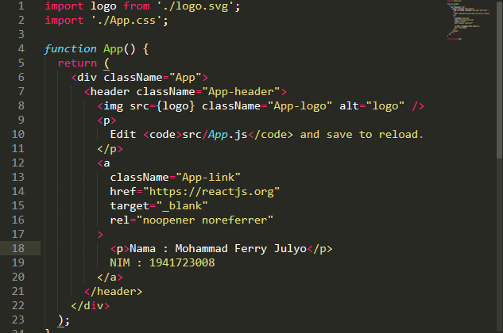
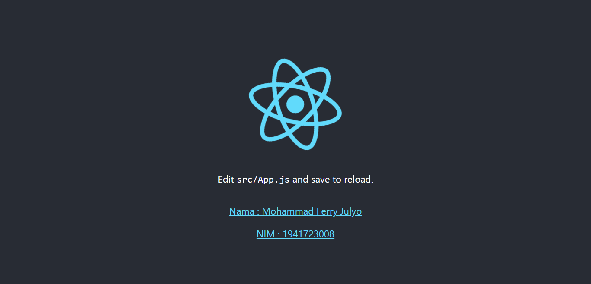

# 02 - Layout

## Tujuan Pembelajaran

1. Mahasiswa memahami konsep ReactJS
2. Mahasiswa dapat membuat project menggunakan ReactJS

## Hasil Praktikum

1. 

2. 

3. 

4. 

5. 

[link App.js](../../src/02_layout/App.js) 

[link Index.js](../../src/02_layout/Index.js) 