# 02 - Layout

## Tujuan Pembelajaran

1. Mahasiswa lebih memahami tentang JavaScript XML (JSX)
2. Mahasiswa dapat melakukan render element, membuat component dan penggunaan props, memanfaatkan state dan lifecycle, menangani event, kondisional rendering, penggunaan list dan key, serta penggunaan forms.

## Hasil Praktikum 1

1. 
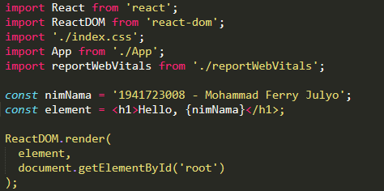

2. 
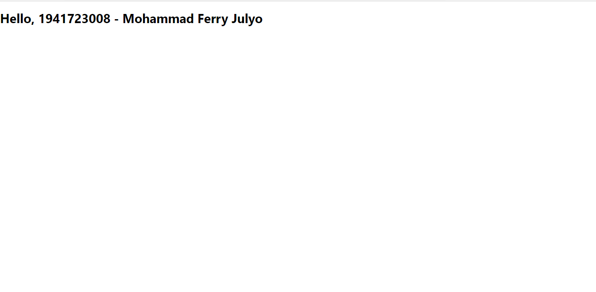

3.
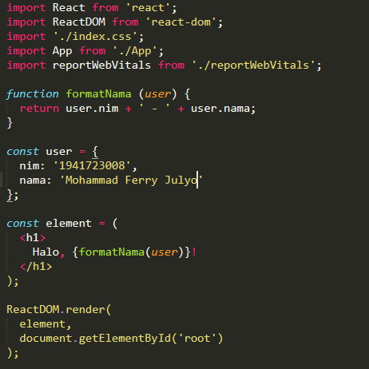

4.

[link App.js](../../src/03_layout/App.js) 

[link Index.js](../../src/03_layout/Index.js) 

## Hasil Praktikum 2

1.
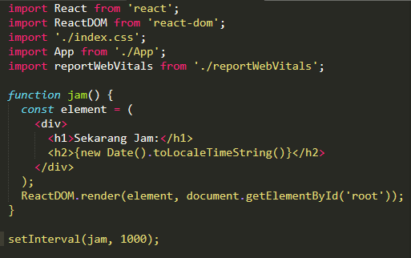

2.
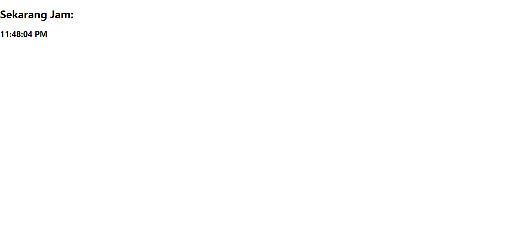

## Hasil Praktikum 3
1.
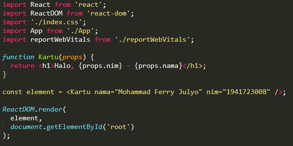

2.
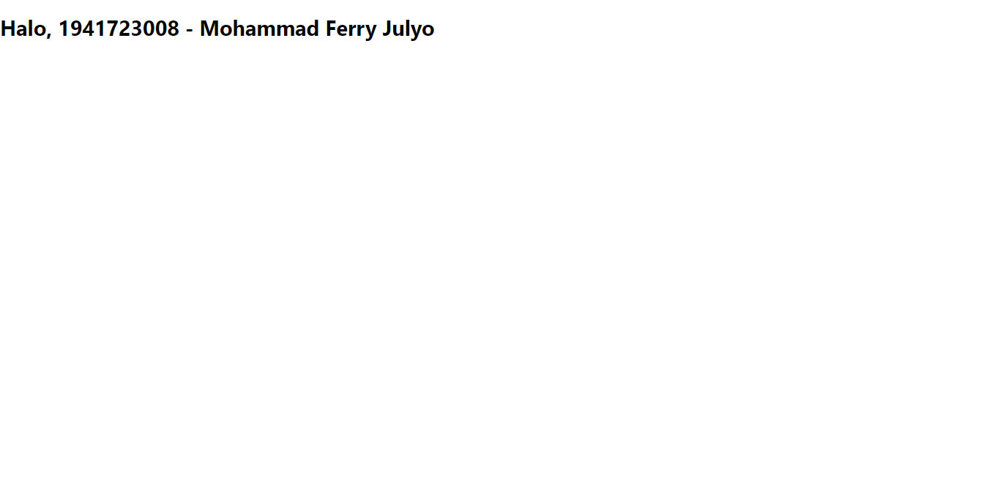

## Hasil Praktikum 4

1.
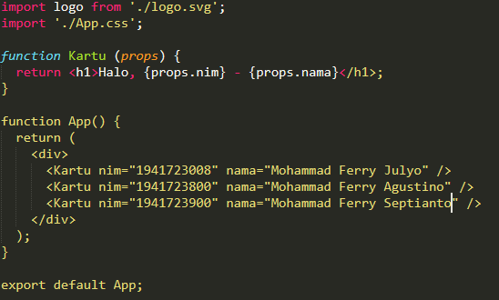

2.
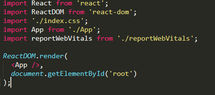

3.
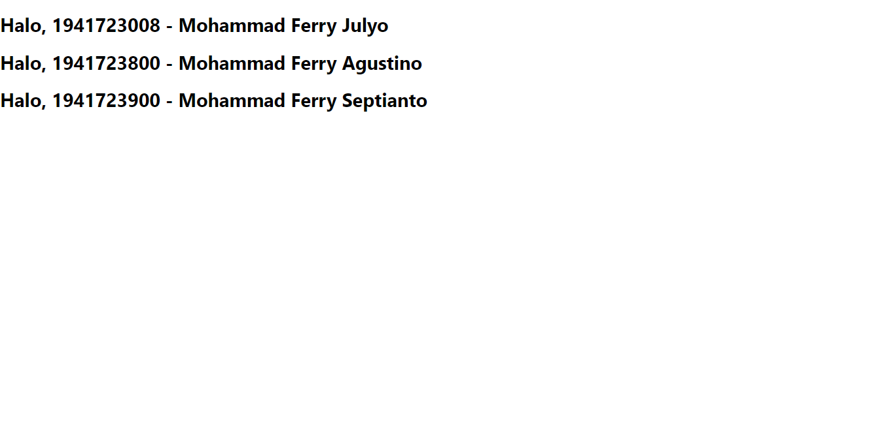

## Hasil Praktikum 5

1.
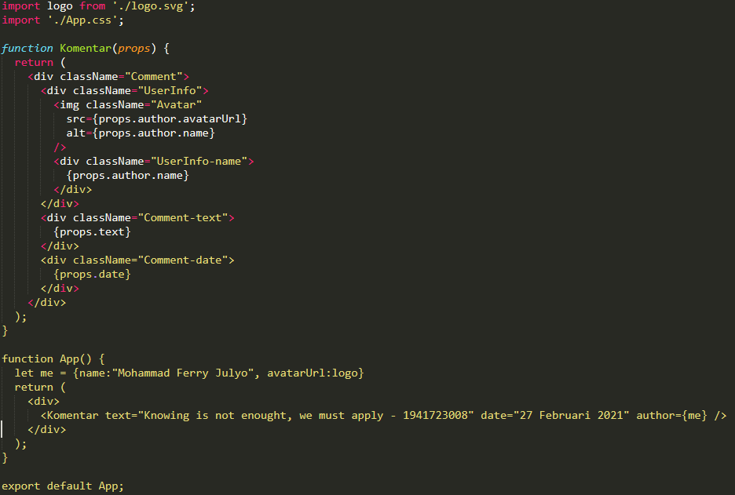

2.

3.
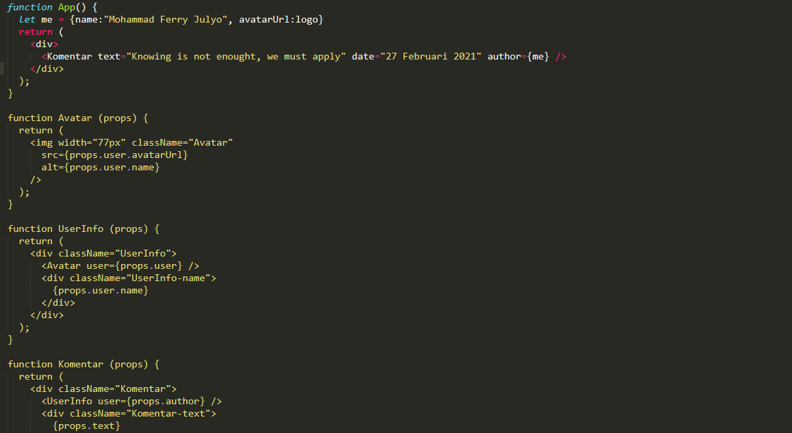

4.
2.

## Hasil Praktikum 6

1.
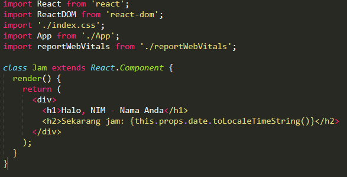

2.
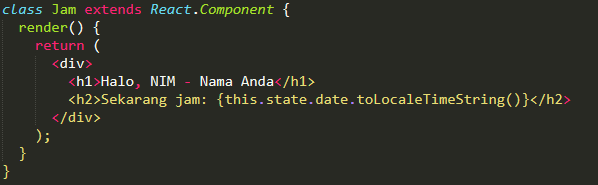

3.
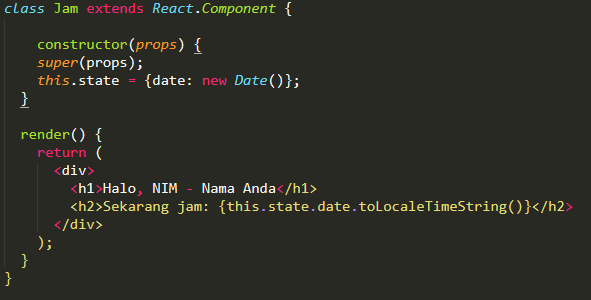

4.
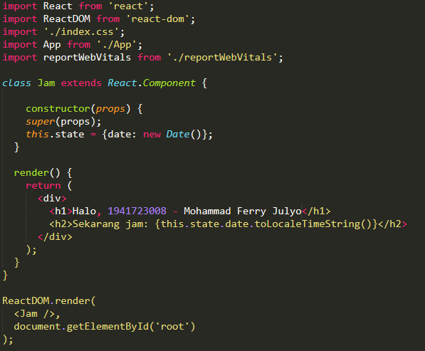

5.

6.
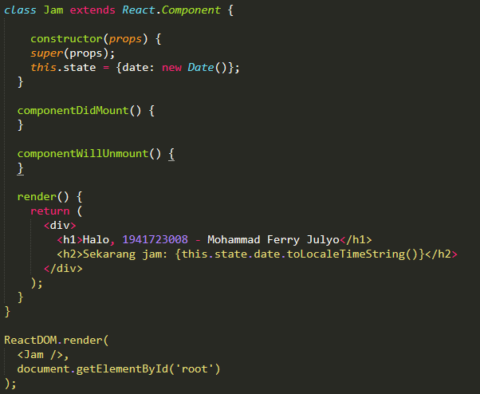

7.
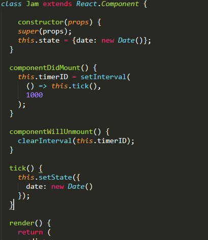

8.
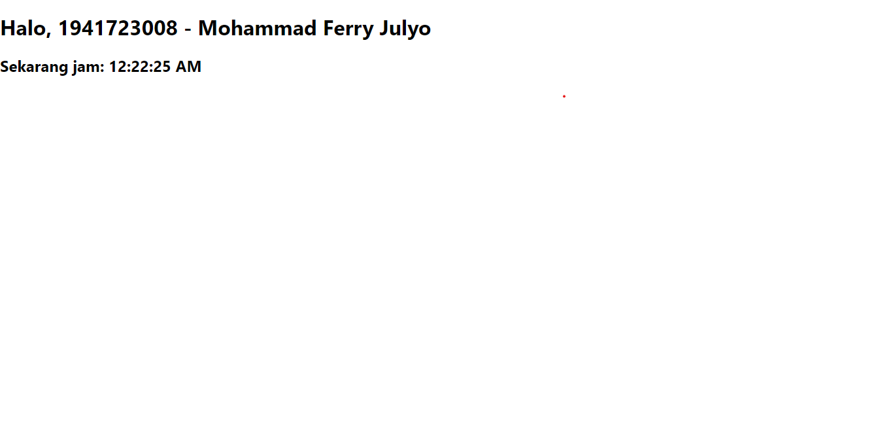
