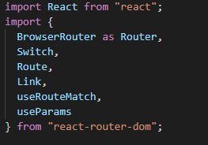
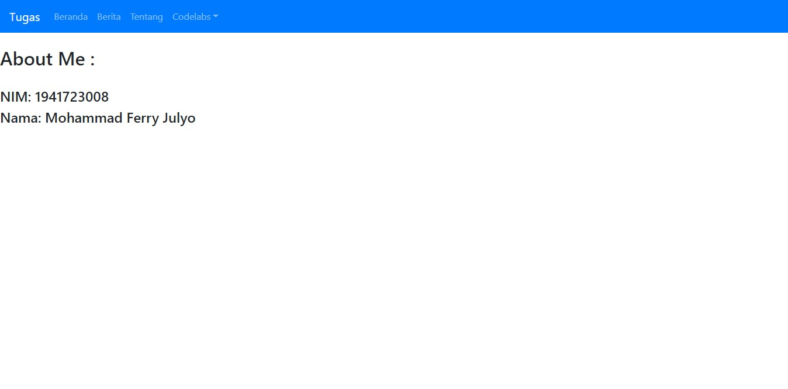

# 05 - API dan Router

## Tujuan Pembelajaran

1. Mahasiswa dapat mengambil data API
2. Mahasiswa dapat Membuat routing di ReactJS.

## Hasil Praktikum 1 : Menampilkan data dari API

1. 

2. 

3.

4.

[link Index.js](../../src/05_API_dan_Router/Praktikum1/index.js) 

## Hasil Praktikum 2 : Membuat routing sederhana

1.

2. 

3.

4.

5.

6.

[link Index.js](../../src/05_API_dan_Router/Praktikum2/index.js) 
[link App.js](../../src/05_API_dan_Router/Praktikum2/App.js) 

## Hasil Praktikum 3 : Membuat routing bersarang (Nested Routing)

1.

2. 

3.

4.

5.

6.

7.

8.

9.

10.

[link Index.js](../../src/05_API_dan_Router/Praktikum3/index.js) 
[link App.js](../../src/05_API_dan_Router/Praktikum3/App.js) 

## Tugas

1. Import Router dan Bootstrap. 

2. Membuat function Beranda, Tentang, Berita dan Topik. 
  

3. Membuat function codelabs. 

4. Membuat class Blog(Load API). 

5. Export function App, yang me-return Router dan Bootstrap(Tampilan pada web browser dapat diatur disini). 

6. Pastikan index.js meng-load/render pada App. 

7. Tampilan awal(Beranda)

8. Tampilan berita(Api)

9. Tampilan about(Tentang)

10. 

[link Index.js](../../src/05_API_dan_Router/Tugas/index.js) 
[link App.js](../../src/05_API_dan_Router/Tugas/App.js) 