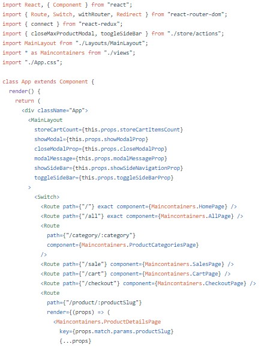

# 05 - API dan Router

## Tujuan Pembelajaran

1. Mahasiswa dapat mengambil data API
2. Mahasiswa dapat Membuat routing di ReactJS.

## Hasil Praktikum 1 : Menampilkan data dari API

1. 

2. 

3.

4.

5.

6.

7.

8.

9.

10.

11.

12.

13.

14.

15.

16.

17.

18.

[link Index.js](../../src/06_REACT_REDUX/Praktikum1/index.js) 

[link App.js](../../src/06_REACT_REDUX/Praktikum1/app.js) 

## Tugas

### Pertanyaan

1. Jelaskan maksud sintaks this.props.dispatch pada praktikum sebelumnya!

    Jawab :

    Maksud dari sintaks diatas ialah untuk mengubah state yang terdapat pada store

2. Jelaskan maksud istilah yang ada dalam Redux berikut ini:

    a. Actions

    b. Reducers

    c. Action creators

    d. Middleware

    e. Pure functions

    f. Immutability

    Jawab :

    a. Action = merupakan sebuah object yang memiliki property type

    b. Reducer = bagian redux yang merubah state menjadi respon yang terjadi ketika Action di dispatch()

    c. Action Creators = pembuatan action

    d. Middleware = sebuah alat yang digunakan untuk merubah hasil dari request sebelum masuk menjadi response

    e. Pure Function = sebuah kondisi dimana sebuah fungsi tidak boleh mengubah input value yang diberikan

    f. Immutability = value yang tidak dapat dirubah secara langsung

3. Jelaskan maksud sintaks export default connect(mapStateToProps)(Counter) pada praktikum!

    Jawab : 

    Maksud dari sintaks diatas ialah untuk membuat koneksi dengan Counter.

4. Carilah sebuah studi kasus aplikasi yang cukup kompleks di GitHub yang memanfaatkan Redux! Kemudian screenshot bagian kode program mana yang merupakan proses Redux dan jelaskan prosesnya! (cantumkan link repository GitHub yang Anda temukan).

	Jawab :

	

	[link Github Tugas Redux](https://github.com/collinsNick/React-redux-shopping-web-app) 