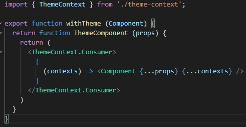

# 07 - Context dan HOC

## Tujuan Pembelajaran

1. Mahasiswa lebih memahami Konsep Context dan manfaatnya.
2. Mahasiswa lebih memahami Konsep HOC di ReactJS.

## Hasil Praktikum 1 : Membuat Tema Aplikasi Sederhana

1. Buka project React di VS Code yang sebelumnya telah dibuat atau bisa membuat project React baru dengan perintah di console: npx create-react-app theme-app

2. Buatlah folder baru bernama ThemeContext di dalam folder src, sehingga menjadi src/ThemeContext.

3. Buatlah file theme-context.js di src/ThemeContext, kemudian isi kodenya adalah sebagai berikut.

4. Lalu buatlah file withTheme.js di src/ThemeContext dan isi kode programnya adalah sebagai berikut:

5. Kemudian buatlah file ThemeProvider.js di src/ThemeContext dengan isi kode sebagai berikut:

6. Selanjutnya buatlah file di src/Menu.js dengan kode berikut ini.

7. Lalu buatlah file di src/SetColor.js dengan kode berikut ini.

8. Akhirnya file src/App.js kita edit dengan kode berikut ini.

[link theme-context.js](../../src/07_Context_dan_HOC/Praktikum1/ThemeContext/theme-context.js)

[link ThemeProvider.js](../../src/07_Context_dan_HOC/Praktikum1/ThemeContext/ThemeProvider.js)

[link withTheme.js](../../src/07_Context_dan_HOC/Praktikum1/ThemeContext/withTheme.js)

[link Menu.js](../../src/07_Context_dan_HOC/Praktikum1/Menu.js)

[link SetColor.js](../../src/07_Context_dan_HOC/Praktikum1/SetColor.js)

[link Index.js](../../src/07_Context_dan_HOC/Praktikum1/index.js)

[link App.js](../../src/07_Context_dan_HOC/Praktikum1/app.js)