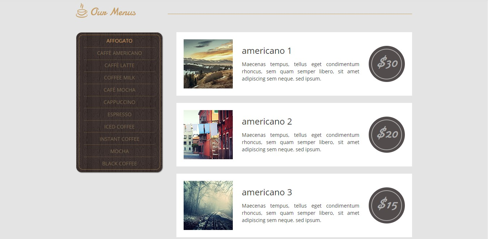
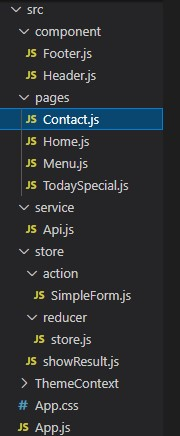

# 08 - UTS

## Soal

Anda diminta oleh sebuah perusahaan untuk mengonversi templat web pada tautan ini
https://s.id/templat-web (sesuai pembagian presensi dari dosen) menjadi sebuah aplikasi React. 
Artinya, Anda harus mengubah HTML statis tersebut menjadi komponen-komponen React menjadi 
sebuah Single-Page Application (SPA). Selain itu, ada permintaan spesifikasi lain, yaitu:

a. Anda diminta untuk menggunakan React Router pada setiap menu di web tersebut.

b. Anda diminta untuk meletakkan semua konten (seperti artikel, link gambar, komentar, dsb)
web di file JSON kemudian dipanggil dengan API (GET).

c. Anda diminta untuk menggunakan Redux agar konten web tersimpan di store, sehingga 
proses GET API tidak membutuhkan waktu lebih lama (low latency).

## 1 - Aplikasi React (SPA)

1. Mengconvert .html menjadi .js, file yang akan saya convert akan saya taruh dalam folder sendiri yaitu <b>assets</b> .

/1.jpg)

2. Ada 4 file .html yang akan saya convert, tapi saya akan membuat <b>Header</b> dan <b>Footer</b> menjadi file tersendiri, jadi kita akan membuat 6 file hasil convert.

/2.jpg)

3. Kemudian copy isi dari <b>index.html</b> pada bagian body dan masukkan ke <b>Home.js</b>, atur agar error menghilang dengan menghapus <b>Comment</b> atau memberi batas akhir("/") pada beberapa class yang error. 

/3.jpg)

4. Lakukan hal serupa pada <b>Header</b> dan <b>Footer</b>.

/4.jpg)

5. Kemudian pada <b>public index.html</b>, hapus seluruh isi dari <b>head</b> dan ganti dengan <b>head</b> dari source <b>index.html</b>.

/5.jpg)

6. Jika sudah benar maka tampilan web akan seperti gambar dibawah.

/6.jpg)

## 2 - Menggunakan React Router setiap menu

1. Buka <b>Header.js</b> dan lakukan import Router.

2. Kemudian ganti <b>a href</b> dengan <b>Link</b> seperti gambar dibawah.

3. Selanjutnya beralih ke <b>App.js</b>, tambahkan perintah dibawah.

4. Jika benar maka anda bisa berganti page website dengan memanfaatkan React Router.

## 3 - Menggunakan API ke file JSON

1. Pertama-tama adalah mempersiapkan file <b>.json</b> yang akan kita buat sebagai API.

2. Buat repo baru di github, kemudian upload <b>image</b> dan file <b>.json</b> kedalamnya.

3. Kemudian buat server json melalui <b>my-server-json.typicode.com</b>, contoh : <b>https://my-json-server.typicode.com/FerryJulyo/FerryJulyo.github.io/blog</b>

4. Selanjutnya buatlah sebuah file <b>Api.js</b> pada folder <b>Service</b>.

5. Kemudian masukkan code dibawah, atur sesuai API kalian.

6. Lalu lakukan import API pada <b>Menu.js</b>.

7. Terakhir, hapus semua Class yang berfungsi menampilkan menu dan ganti dengan <b>API</b>.

8. Hasil akhir akan menampilkan data Menu dari API yang telah kita buat sebelumnya.

## 4 - Menggunakan Redux

1. Pertama-tama Buat 3 file js baru seperti gambar dibawah.

2. Pada SimpleForm.js masukkan code dibawah, ini akan menjadi tampilan inputan form.

3. Kemudian pada store.js masukkan code dibawah.

4. Lalu masukkan code dibawah pada showResult.js.

5. Buka Contact.js lalu lakukan imort seperti gambar dibawah.

6. Terakhir ganti form asli pada contact.js dengan code dibawah.

7. Hasil akhir.

## 5 - React Project Structure Best Practices for Scalable Application
https://dev.to/syakirurahman/react-project-structure-best-practices-for-scalable-application-18kk

1. Struktur folder yang saya gunakan.

[link Public index.html](../../src/08_UTS/public/index.html)

[link Header.js](../../src/08_UTS/src/component/Header.js)

[link Footer.js](../../src/08_UTS/src/component/Footer.js)

[link Home.js](../../src/08_UTS/src/pages/Home.js)

[link Menu.js](../../src/08_UTS/src/pages/Menu.js)

[link Contact.js](../../src/08_UTS/src/pages/Contact.js)

[link TodaySpecial.js](../../src/08_UTS/src/pages/TodaySpecial.js)

[link API.js](../../src/08_UTS/src/service/Api.js)

[link Index.js](../../src/08_UTS/src/Index.js)

[link App.js](../../src/08_UTS/src/App.js)