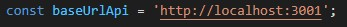
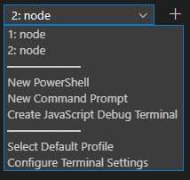
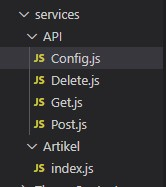
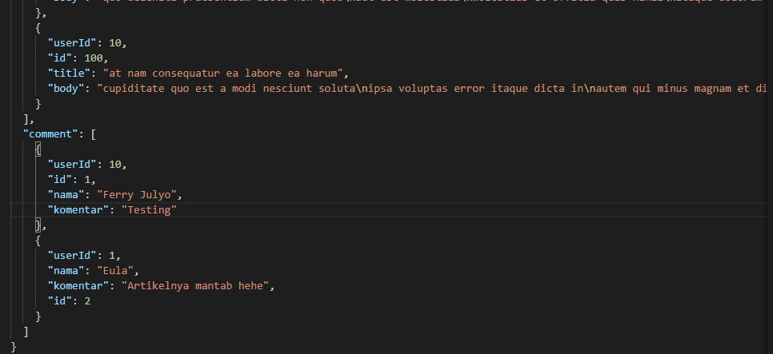

# 09 - Global_API_dan_Hooks

## Tujuan Pembelajaran

1. Mahasiswa lebih memahami Konsep dan implementasi Global API.
2. Mahasiswa lebih memahami Konsep dan implementasi Hooks.

## Hasil Praktikum 1 : Membuat Global API

1. Anda dapat membuat project baru React atau melanjutkan praktikum dari Codelab 5 tentang interaksi dengan API.

2. Buatlah folder services dalam folder src, lalu buat file index.js di dalam folder services seperti pada gambar berikut.

3. Buat konstanta baseUrlApi di src/services/index.js sebagai alamat url utama API yang digunakan. Anda dapat mengaturnya secara terpusat di variabel baseUrlApi ini.

4. Kemudian buat konstanta GetAPI untuk service GET.

5. Lalu buat konstanta getNewsBlog untuk mendapatkan isi artikel. Dalam konstanta ini terdapat fungsi yang memanggil GetAPI berisi parameter posts yang diurutkan secara descending berdasarkan atribut id.

6. Selanjutnya buat konstanta API yang nanti akan diisi service GET, POST, dan DELETE.

7. Buat folder src/components dan isi file baru dengan nama BlogPost.js.

8. Buat komponen DaftarArtikel di src/components/BlogPost.js untuk menampilkan isi artikel.

9. Kemudian buat class BlogPost

10. Kemudian pindah ke file src/App.js kita panggil class BlogPost untuk dirender.

11. Selanjutnya pindah ke src/index.js seperti biasa kita render.

12. Kemudian save semua dan run npm start untuk melihat hasilnya di browser. Apa yang terjadi ? Apakah tampil data artikel tersebut ?

## Hasil Praktikum 1 : Membuat Restful API Lokal

13. Dari praktikum sebelumnya, tentu data artikel belum tampil karena server API belum kita jalankan di alamat http://localhost:3001 . Kita siapkan server API dengan membuat file listArtikel.json di root project React kita. 

14. Buka file listArtikel.json lalu isi datanya dengan copy dari https://jsonplaceholder.typicode.com/posts

15. Setelah itu save, lalu buka tab terminal baru di vs-code (agar server npm start milik react tadi tetap running) dengan cara klik icon + seperti di gambar berikut.

16. Ketikkan perintah berikut dan pastikan Anda berada di root project listArtikel.json berada.

17. Sekarang Anda dapat merefresh halaman react di browser dan seharusnya data artikel sudah tampil sesuai isi dari listArtikel.json.

## Hasil Praktikum 1 : Membuat Global API Service POST

1. Buka file src/services/index.js dan tambahkan kode POST berikut ini.

2. Kemudian tambahkan konstanta postNewsBlog untuk data yang dikirim.

3. Lalu bagian konstanta API kita tambahkan method di atas seperti pada gambar berikut.

4. Selanjutnya pindah ke file src/components/BlogPost.js tambahkan variabel postArtikel untuk menampung data artikel yang akan dikirim melalui method POST.

5. Kemudian bagian render() kita tambahkan form untuk submit artikel seperti kode berikut.

6. Selanjutnya kita buat fungsi handleTombolSimpan di dalam class BlogPost.

7. Lalu buat fungsi handleOnChange

8. Save semua pekerjaan dan silakan refresh di browser. Apakah sudah bisa menambahkan data artikel baru ?

## Hasil Praktikum 1 : Membuat Global API Service DELETE

1. Buka file src/services/index.js dan tambahkan kode DELETE berikut ini.

2. Kemudian tambahkan konstanta deleteNewsBlog untuk data yang dikirim.

3. Lalu bagian konstanta API kita tambahkan method di atas seperti pada gambar berikut.

4. Selanjutnya pindah ke file src/components/BlogPost.js bagian fungsi render() tambahkan tombol Hapus.

5. Terakhir buat fungsi handleTombolHapus yang berisi kode berikut.

6. Silakan coba refresh aplikasi react Anda di browser, seharusnya sudah muncul tombol untuk menghapus artikel yang dipilih.

## Hasil Praktikum 1 : Mengelola Global API Service

1. Buat folder baru di src/services/API dan src/services/Artikel beserta file baru didalamnya seperti pada struktur di bawah ini.

2. Isi file src/services/API/Config.js adalah sebagai berikut. File Config.js ini bisa menampung variabel global yang digunakan selama proses API.

3. Isi file src/services/API/Get.js adalah sebagai berikut.

4. Selanjutnya file Post.js dan Delete.js isinya sesuai dengan praktikum sebelumnya, hanya saja dipindah di file terpisah. Silakan disesuaikan seperti pada file Get.js!

5. Kemudian pada file src/services/Artikel/index.js berubah menjadi seperti berikut ini.

6. Terakhir menyesuaikan import pada bagian komponen BlogPost.js dengan memanggil API pada bagian folder Artikel.

7. Simpan semua pekerjaan dan lihat hasilnya di browser. Seharusnya aplikasi react tetap berjalan normal seperti sebelumnya. Hanya saja struktur folder API yang telah kita buat menjadi lebih teratur dan mudah untuk dikelola.

## TUGAS

[link Index.js](../../src/09_Global_API_dan_Hooks/src/index.js)

[link App.js](../../src/09_Global_API_dan_Hooks/src/app.js)

[link listArtikel.json](../../src/09_Global_API_dan_Hooks/listArtikel.json)

[link BlogPost.js](../../src/09_Global_API_dan_Hooks/src/components/BlogPost.js)

[link CommentPost.js](../../src/09_Global_API_dan_Hooks/src/components/CommentPost.js)

[link Config.js](../../src/09_Global_API_dan_Hooks/src/services/API/Config.js)

[link Get.js](../../src/09_Global_API_dan_Hooks/src/services/API/Get.js)

[link Post.js](../../src/09_Global_API_dan_Hooks/src/services/API/Post.js)

[link Delete.js](../../src/09_Global_API_dan_Hooks/src/services/API/Delete.js)

[link Artikel/index.js](../../src/09_Global_API_dan_Hooks/src/services/Artikel/index.js)

[link Komentar/comment.js](../../src/09_Global_API_dan_Hooks/src/services/Komentar/comment.js)