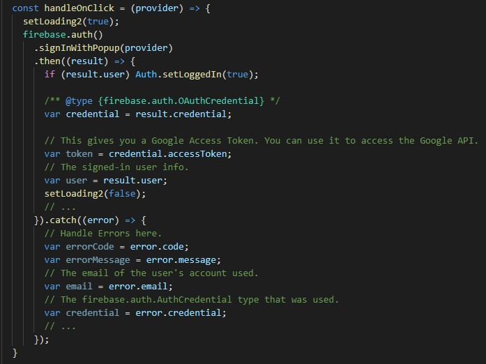

# 10 - Firebase di ReactJS

## Tujuan Pembelajaran

1. Mahasiswa lebih memahami Konsep dan implementasi Firebase di ReactJS.

## Hasil Praktikum 1 : Membuat Form Register

1. Anda dapat membuat project baru React atau melanjutkan praktikum dari Codelab sebelumnya.

2. Buatlah komponen Register.js dalam folder src/components, lalu buat function Register.

3. Buat tiga variabel hooks dan menggunakan context di dalam function Register() seperti berikut.

4. Kemudian kita import bagian yang dibutuhkan di file Register.js.

5. Buat konstanta AuthContext di src/App.js seperti berikut.

6. Selanjutnya buat return form Register pada komponen function Register().

7. Buat fungsi handleForm pada komponen Register yang sementara isinya seperti berikut. Nanti kita akan ganti dengan fungsi firebase.

8. Jangan lupa di luar function Register() perlu ditambahkan sintaks export agar dapat digunakan pada file App.js nantinya.

## Membuat Komponen Header

9. Kita buat komponen Header yang berfungsi untuk menampilkan menu Register dan Login. Buat file Header.js di src/components. Isinya sebagai berikut.

10. Kemudian buat file routes.js di folder src/components.

## Membuat App Utama

11. Kita pindah ke file src/App.js yang menentukan tampilan render pada aplikasi React kita.

12. Jangan lupa import yang diperlukan pada file src/App.js

13. Selanjutnya perlu disesuaikan style pada App.css.

14. Simpan semua pekerjaan lalu lihat hasilnya di browser. Seharusnya form register sudah tampil seperti pada gambar berikut.

## Hasil Praktikum 2: Membuat Form Login

1. Buat komponen login di src/components/Login.js yang isinya sama persis dengan komponen Register.js hanya saja berbeda teks pada bagian return.

2. Kemudian pada file src/components/routes.js kita tambahkan komponen Login

3. Terakhir save semua file, lalu lihat hasilnya di browser. Seharusnya sudah tampil menu dan form login seperti pada gambar berikut ini.

## Hasil Praktikum 3 : Membuat Koneksi ke Firebase

1. Silakan buka terminal atau command prompt untuk memasang library pada project React kita dengan perintah berikut.

2. Sembari menunggu proses instalasi firebase selesai, silakan buka web firebase di https://console.firebase.google.com/

3. Buat project baru dengan pilih Add project

4. Kemudian beri nama project, misalnya Belajar React

5. Langkah selanjutnya dapat mengaktifkan Google Analytics yang berfungsi untuk melacak pengguna yang mengakses aplikasi React kita. Fungsi ini juga dapat dimatikan jika hanya untuk latihan saja, bukan untuk aplikasi sesungguhnya.

6. Jika kita memilih untuk mengaktifkan Google Analytics, maka akan tampil seperti pada gambar berikut untuk memilih pada akun mana akan diterapkan.

7. Selanjutnya, klik Create project untuk membuat project baru pada firebase. Tunggu hingga proses pembuatan project firebase selesai.

8. Selanjutnya pilih jenis aplikasi web untuk aplikasi React kita.

9. Setelah itu kita akan mendapatkan script konfigurasi yang akan menjadi penghubung dengan project React kita. Salin script tersebut lalu tempel pada file baru di dalam folder src yang kita beri nama firebase.config.js (gambar dibawah adalah contoh, sesuaikan script yang anda dapat dari firebase).

Paste di src/firebase.config.js

10. Kembali ke web firebase lalu pilih Authentication > get started, lalu bagian Sign-in method aktifkan untuk Email/Password dan Google sign-in.

11. Jika sudah aktif kedua method sign-in tersebut, maka akan ada tanda enabled seperti pada gambar berikut.

## Membuat Koneksi Firebase di Form Register

12. Selanjutnya kita pindah ke project React di vs-code. Jika telah berhasil memasang firebase, maka perlu kita import library tersebut di file src/App.js lalu inisiasi dengan konfigurasi firebase yang sudah didapat dari web firebase tadi.

13. Lalu buka komponen Register di src/components/Register.js lakukan tambahan import firebase dan ubah isi handleForm seperti berikut.

14. Save lalu coba untuk registrasi di browser seperti pada gambar berikut. Jika berhasil registrasi, maka status Is logged in? menjadi true.

Kemudian ada tambahan data di web firebase seperti berikut.

## Membuat Koneksi Firebase di Form Login

1.  Buka komponen Login di src/components/Login.js lalu tambahkan import firebase dan isi handleForm diganti seperti berikut.

2. Save lalu lihat hasilnya di browser. Silakan coba untuk login dengan email dan password yang tadi telah didaftarkan.

## Tugas

1. Dari praktikum sebelumnya, tambahkan aksi pada tombol "Login with Google" dan "Logout" agar bisa melakukan login dan logout dengan akun Google yang sudah kita miliki.

2. Tambahkan animasi loading saat melakukan registrasi dan login. Boleh menggunakan dari tema boostrap atau lainnya.

1. Tambahkan beberapa import berikut pada Register.js

2. Tambahkan const loading.

3. Membuat Handle on click untuk tombol gmail.

4. Sisipkan OnClick pada Button, Lalu tambahkan loading animation seperti gambar dibawah.
 

5. Membuat Logout.js

6. Membuat function Logout

7. Membuat return.

8. Hasil Akhir :

[link Index.js](../../src/10_Firebase_di_ReactJS/src/index.js)

[link App.js](../../src/10_Firebase_di_ReactJS/src/app.js)

[link Header.js](../../src/10_Firebase_di_ReactJS/src/component/Header.js)

[link routes.js](../../src/10_Firebase_di_ReactJS/src/component/routes.js)

[link Register.js](../../src/10_Firebase_di_ReactJS/src/component/Register.js)

[link Login.js](../../src/10_Firebase_di_ReactJS/src/component/Login.js)

[link Logout.js](../../src/10_Firebase_di_ReactJS/src/component/Logout.js)