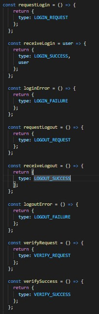
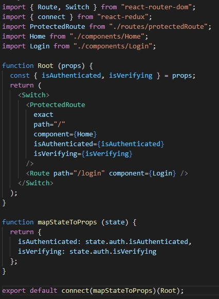
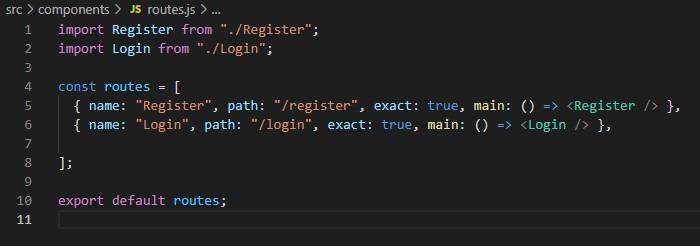

# 11 - Redux Thunk

## Tujuan Pembelajaran

1. Mahasiswa lebih memahami Konsep dan implementasi Redux-Thunk di ReactJS.

2. Mahasiswa lebih memahami Konsep dan implementasi Firebase Login dengan Redux-Thunk di ReactJS.

## Hasil Praktikum 1 : Membuat Form Register

1. Anda dapat membuat project baru React atau melanjutkan praktikum dari Codelab sebelumnya.

2. Ubahlah isi kode firebase.config.js seperti berikut.

3. Buatlah folder dan file baru di src/redux/actions/auth.js lalu isi dengan kode berikut.

4. Kemudian tambahkan fungsi action dibawahnya.

5. Lalu tambahkan juga dibawahnya fungsi untuk login, logout, dan verifikasi akun dengan firebase seperti berikut.

6. Selanjutnya buat folder dan file baru di src/redux/reducers/auth.js.

7. Buat file baru index.js di folder reducers tersebut yang isinya seperti berikut.

8. Buat file baru di src/redux/configureStore.js untuk mengonfigurasi store kita dengan Redux Thunk. Jangan lupa library Redux Thunk diinstall seperti pada langkah materi sebelumnya pada codelab ini. Isi kode dari file configureStore.js adalah sebagai berikut.

## Membuat Form Login dan Halaman Home

9. Kita buat komponen form Login atau dapat menggunakan komponen Login dari Codelab 10. Buka file Login.js di src/components. Sesuaikan Isi kodenya seperti berikut.

10. Kemudian buat file Home.js di folder src/components.

## Membuat Route yang Diproteksi

11. Buatlah folder dan file baru di src/routes/protectedRoute.js yang isinya sebagai berikut.

## Membuat App Utama

12. Kita buat komponen Root yang berfungsi untuk memverifikasi user yang sudah terautentikasi atau belum, sehingga bisa dilakukan kontrol terhadap route ke App kita. Buatlah file baru di src/Root.js dengan isi kode sebagai berikut.

13. Kita pindah ke file src/App.js yang menentukan tampilan render pada aplikasi React kita.

14. Jangan lupa import yang diperlukan pada file src/App.js

15. Simpan semua pekerjaan lalu lihat hasilnya di browser. Seharusnya form login sudah tampil seperti pada gambar berikut.

## Tugas

1. Berdasarkan praktikum yang telah Anda lakukan, jelaskan perbedaan fitur yang ada dalam komponen Login dan Home! Mengapa komponen Login tidak menggunakan class seperti pada komponen Home ?

2. Jelaskan kegunaan dan alur logika dari protectedRoute.js !

3. Coba lakukan login dengan email atau password yang salah, apa yang terjadi? Jelaskan!

4. Jika Anda berada di halaman Home, coba akses form login tanpa melakukan logout. Apakah form login bisa diakses? Jelaskan!

5. Tambahkan menu Register pada form login sehingga user yang belum terdaftar dapat melakukan registrasi! Jika registrasi sukses, maka user langsung diarahkan ke halaman Home.

# Jawab

1. Tambahkan beberapa import berikut pada Register.js

2. Tambahkan const loading.

3. Membuat Handle on click untuk tombol gmail.

4. Sisipkan OnClick pada Button, Lalu tambahkan loading animation seperti gambar dibawah.

5. Membuat Logout.js

[link Index.js](../../src/10_Firebase_di_ReactJS/src/index.js)

[link App.js](../../src/10_Firebase_di_ReactJS/src/app.js)

[link Header.js](../../src/10_Firebase_di_ReactJS/src/component/Header.js)

[link routes.js](../../src/10_Firebase_di_ReactJS/src/component/routes.js)

[link Register.js](../../src/10_Firebase_di_ReactJS/src/component/Register.js)

[link Login.js](../../src/10_Firebase_di_ReactJS/src/component/Login.js)

[link Logout.js](../../src/10_Firebase_di_ReactJS/src/component/Logout.js)