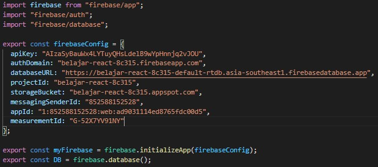

# 11 - CRUD Firebase

## Tujuan Pembelajaran

1. Mahasiswa lebih memahami Konsep dan implementasi CRUD dengan Firebase di ReactJS.

## Hasil Praktikum 1 : Konfigurasi Database Firebase

1. Silakan buka console Firebase Anda dengan melanjutkan project dari codelab 10 dan 11. Lalu pilih menu Realtime Database di sidebar kiri > klik Create Database.

2. Selanjutnya akan tampil untuk melakukan konfigurasi database seperti pada gambar berikut. Pilih lokasi server terdekat, yaitu Singapore. Karena lokasi kita berada di Indonesia, sehingga diharapkan dapat lebih cepat ketika mengakses data.

3. Lalu pada langkah kedua Security rules, kita pilih locked mode, artinya database kita masih dalam proteksi (tidak dapat dibaca dan ditulis). Nanti kita konfigurasi security rules ini agar dapat diakses oleh user yang terautentikasi saja.

4. Selanjutnya masuk ke Project settings pada menu sidebar.

5. Pilih Config pada bagian SDK setup and configuration untuk mendapatkan nilai konfigurasi Firebase yang akan kita gunakan pada aplikasi React.

6. Ubahlah isi kode firebase.config.js seperti berikut. Perbedaannya hanya penambahan variabel databaseURL pada firebaseConfig dan import firebase/database.

7. Lalu pada menu Realtime Database > pilih tab Rules, kemudian Edit rules seperti pada gambar berikut.

## Hasil Praktikum 2 : Membuat Fungsi Create Artikel

1. Pertama, pastikan variabel DB sudah kita import dari file firebase.config. Karena Global API sudah digantikan dengan firebase, maka boleh kita hapus atau comment saja.

2. Kemudian fungsi ambilDataDariServerAPI diganti dengan kode berikut.

3. Kita tambahkan fungsi baru untuk menyimpan data artikel ke database firebase.

4. Selanjutnya ganti isi fungsi handleTombolSimpan dengan kode berikut.

5. Lalu tambahkan fungsi componentDidUpdate seperti berikut.

6. Terakhir kita sesuaikan fungsi render seperti berikut dengan komponen dari react-bootstrap

Lalu kita import komponen BlogPost ke komponen Home (dari Codelabs 11), agar komponen artikel hanya dapat diakses oleh akun yang telah login seperti pada gambar berikut.

## Hasil Praktikum 3 : Membuat Fungsi Hapus Artikel

1. Kembali ke komponen BlogPost, ganti isi fungsi handleTombolHapus seperti berikut.

2. Simpan hasil pekerjaan Anda, lalu lihat hasilnya di browser. Seharusnya artikel sudah bisa dihapus dengan menekan tombol Hapus. Kemudian cek data artikel di database pada console Firebase.

## Hasil Praktikum 4 : Membuat Fungsi Edit (Update) Artikel

## Tugas

1. Berdasarkan praktikum yang telah Anda lakukan, jelaskan perbedaan fitur yang ada dalam komponen Login dan Home! Mengapa komponen Login tidak menggunakan class seperti pada komponen Home ?

2. Jelaskan kegunaan dan alur logika dari protectedRoute.js !

3. Coba lakukan login dengan email atau password yang salah, apa yang terjadi? Jelaskan!

4. Jika Anda berada di halaman Home, coba akses form login tanpa melakukan logout. Apakah form login bisa diakses? Jelaskan!

5. Tambahkan menu Register pada form login sehingga user yang belum terdaftar dapat melakukan registrasi! Jika registrasi sukses, maka user langsung diarahkan ke halaman Home.

# Jawab

1. Karena parameter props dibutuhkan oleh login.js, sedangkan home.js tidak.

2. Intinya adalah membuat sebuah proteksi yang akan mengecek autentikasinya, Jadi akan mengecek autentikasinya terlebih dahulu jika bernilai true maka akan di redirect ke halaman home, jika false maka akan diredirect ke halaman login.

3. Akan muncul error message di bawah tombol login "mail atau Password Salah!"

4. Bisa diakses sekilas saja, kemudian kembali dialihkan ke halaman Home.

5. Register

[link Index.js](../../src/11_Redux_Thunk/src/index.js)

[link App.js](../../src/11_Redux_Thunk/src/app.js)

[link Header.js](../../src/11_Redux_Thunk/src/components/Header.js)

[link routes.js](../../src/11_Redux_Thunk/src/components/routes.js)

[link Register.js](../../src/11_Redux_Thunk/src/components/Register.js)

[link Login.js](../../src/11_Redux_Thunk/src/components/Login.js)

[link auth.js(action)](../../src/11_Redux_Thunk/src/redux/action/auth.js)

[link auth.js(reducer)](../../src/11_Redux_Thunk/src/redux/reducer/auth.js)

[link index.js(reducer)](../../src/11_Redux_Thunk/src/redux/reducer/index.js)

[link configureStore.js](../../src/11_Redux_Thunk/src/redux/configureStore.js)

[link protectedRoute.js)](../../src/11_Redux_Thunk/src/redux/routes/protectedRoute.js)

