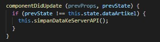

# 12 - CRUD Firebase

## Tujuan Pembelajaran

1. Mahasiswa lebih memahami Konsep dan implementasi CRUD dengan Firebase di ReactJS.

## Hasil Praktikum 1 : Konfigurasi Database Firebase

1. Silakan buka console Firebase Anda dengan melanjutkan project dari codelab 10 dan 11. Lalu pilih menu Realtime Database di sidebar kiri > klik Create Database.

2. Selanjutnya akan tampil untuk melakukan konfigurasi database seperti pada gambar berikut. Pilih lokasi server terdekat, yaitu Singapore. Karena lokasi kita berada di Indonesia, sehingga diharapkan dapat lebih cepat ketika mengakses data.

3. Lalu pada langkah kedua Security rules, kita pilih locked mode, artinya database kita masih dalam proteksi (tidak dapat dibaca dan ditulis). Nanti kita konfigurasi security rules ini agar dapat diakses oleh user yang terautentikasi saja.

4. Selanjutnya masuk ke Project settings pada menu sidebar.

5. Pilih Config pada bagian SDK setup and configuration untuk mendapatkan nilai konfigurasi Firebase yang akan kita gunakan pada aplikasi React.

6. Ubahlah isi kode firebase.config.js seperti berikut. Perbedaannya hanya penambahan variabel databaseURL pada firebaseConfig dan import firebase/database.

7. Lalu pada menu Realtime Database > pilih tab Rules, kemudian Edit rules seperti pada gambar berikut.

## Hasil Praktikum 2 : Membuat Fungsi Create Artikel

1. Pertama, pastikan variabel DB sudah kita import dari file firebase.config. Karena Global API sudah digantikan dengan firebase, maka boleh kita hapus atau comment saja.

2. Kemudian fungsi ambilDataDariServerAPI diganti dengan kode berikut.

3. Kita tambahkan fungsi baru untuk menyimpan data artikel ke database firebase.

4. Selanjutnya ganti isi fungsi handleTombolSimpan dengan kode berikut.

5. Lalu tambahkan fungsi componentDidUpdate seperti berikut.

6. Terakhir kita sesuaikan fungsi render seperti berikut dengan komponen dari react-bootstrap

Lalu kita import komponen BlogPost ke komponen Home (dari Codelabs 11), agar komponen artikel hanya dapat diakses oleh akun yang telah login seperti pada gambar berikut.

## Hasil Praktikum 3 : Membuat Fungsi Hapus Artikel

1. Kembali ke komponen BlogPost, ganti isi fungsi handleTombolHapus seperti berikut.

2. Simpan hasil pekerjaan Anda, lalu lihat hasilnya di browser. Seharusnya artikel sudah bisa dihapus dengan menekan tombol Hapus. Kemudian cek data artikel di database pada console Firebase.

## Hasil Praktikum 4 : Membuat Fungsi Edit (Update) Artikel

1. Kembali ke komponen BlogPost, kita buat form edit-nya terlebih dahulu di bagian fungsi render(). Bisa diletakkan dipaling bawah setelah daftar artikel. Di sini kita menggunakan Modal dari react-bootstrap. Jangan lupa untuk import Modal dari react-bootstrap.

2. Lalu pada bagian state class BlogPost, kita perlu tambahkan showEdit seperti berikut.

3. Selanjutnya tambahkan tombol Edit pada Daftar Artikel sebelah tombol Hapus seperti berikut.

4. Save pekerjaan Anda, lalu lihat hasil tampilannya di browser. Seharusnya sudah tampil tombol Edit seperti berikut. Namun, tombol tersebut belum berfungsi.

5. Buat fungsi handleTombolEdit pada komponen BlogPost seperti berikut. Namun, Anda diminta untuk melengkapi kode program berikut agar artikel yang telah dilakukan update dapat berubah pada halaman maupun di database Firebase.

## Tugas

1. Berdasarkan praktikum 1 yang telah Anda lakukan, jelaskan perbedaan fungsi locked mode dan test mode pada langkah 3 saat Anda konfigurasi database Firebase?

2. Buatlah variabel userId pada praktikum 2 langkah 4 agar dapat menyimpan email dari user yang sedang login, sehingga dapat tersimpan di database!

3. Jelaskan maksud kode ini (dataArtikel || []) pada praktikum 2 langkah 6! Mengapa berbeda dari codelabs sebelumnya untuk menampilkan daftar artikel?

4. Lengkapilah kode pada praktikum 4 langkah 5 agar dapat melakukan update artikel! Mengapa setelah klik tombol Update Artikel, form Modal tidak hilang? Bagaimana Anda mengatasi hal tersebut?

5. Ketika Anda menekan tombol Edit, lalu menekan tombol Batal pada form Modal update artikel. Kemudian coba tambah artikel baru, maka artikel yang tadi kita klik tombol Edit akan berubah jadi data yang artikel baru ditambahkan. Mengapa demikian? Silakan diperbaiki.

# Jawab

1. Intinya adalah membatasi akses terhadap data hanya untuk beberapa user (Locked Mode) atau mengizinkan siapa pun mengakses (Test Mode)

2. Ubah code pada <b>handleTombolSimpan</b>

3. Perintah tersebut berfungsi untuk menampilkan map data dalam bentuk array maupun object. Pada codelabs sebelumnya tidak seperti itu karena data yang diambil hanya berbentuk object.

4. Ubah showEdit yang awalnya false menjadi true, sehingga modal tidak menghilang

5. 

[link Index.js](../../src/11_Redux_Thunk/src/index.js)

[link App.js](../../src/11_Redux_Thunk/src/app.js)

[link Header.js](../../src/11_Redux_Thunk/src/components/Header.js)

[link routes.js](../../src/11_Redux_Thunk/src/components/routes.js)

[link Register.js](../../src/11_Redux_Thunk/src/components/Register.js)

[link Login.js](../../src/11_Redux_Thunk/src/components/Login.js)

[link auth.js(action)](../../src/11_Redux_Thunk/src/redux/action/auth.js)

[link auth.js(reducer)](../../src/11_Redux_Thunk/src/redux/reducer/auth.js)

[link index.js(reducer)](../../src/11_Redux_Thunk/src/redux/reducer/index.js)

[link configureStore.js](../../src/11_Redux_Thunk/src/redux/configureStore.js)

[link protectedRoute.js)](../../src/11_Redux_Thunk/src/redux/routes/protectedRoute.js)

