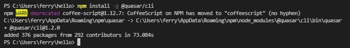
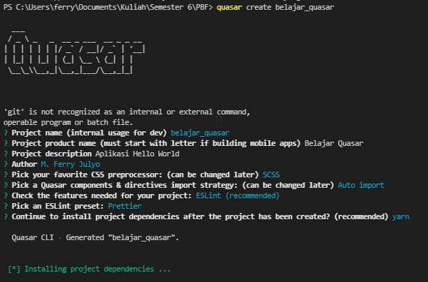
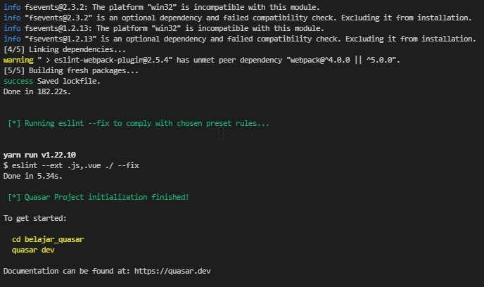
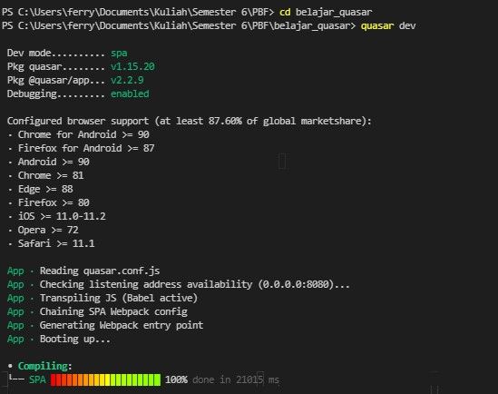
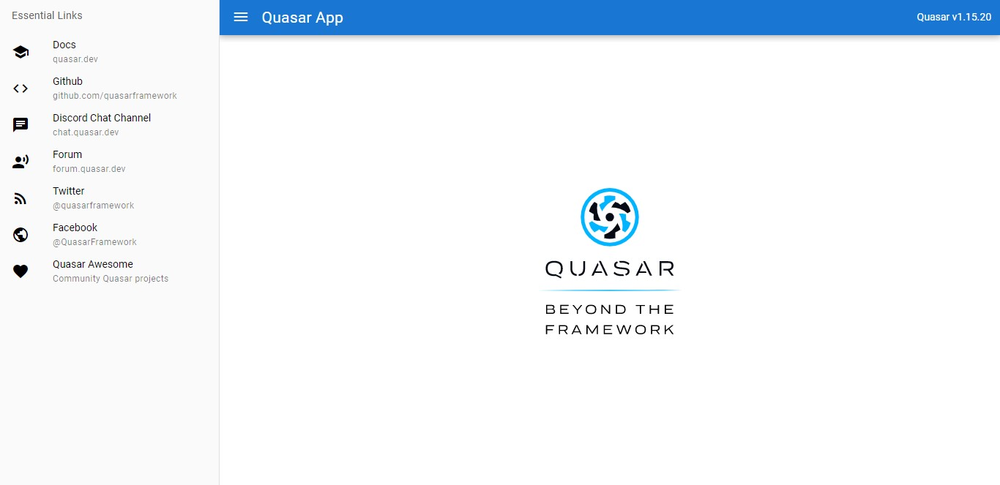
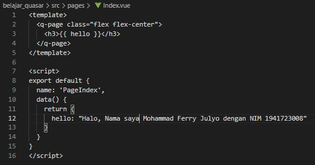
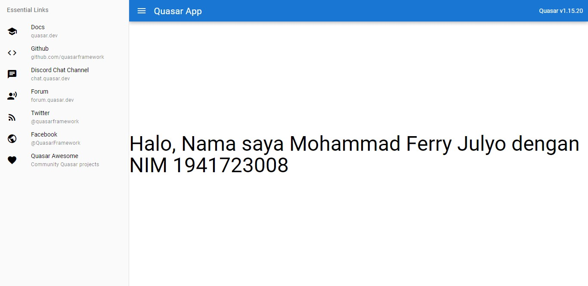

# 13 - Pengenalan Quasar Framework

## Tujuan Pembelajaran

1. Mahasiswa lebih memahami tentang Quasar Framework

2. Mahasiswa dapat membuat project pada Quasar Framework

## Hasil Praktikum 1 : Memulai Quasar Framework

1. Buka CMD atau terminal pada OS Anda, lalu ketik perintah berikut untuk install Quasar CLI.

2. Setelah proses instalasi Yarn dan Quasar berhasil, selanjutnya kita buat folder project Quasar baru pada lokasi dokumen sesuai keinginan kita dengan perintah berikut.

<b>quasar create belajar_quasar</b>

3. Pada saat proses pembuatan project Quasar, maka akan tampil beberapa pertanyaan untuk kita konfigurasi pada project Quasar seperti berikut.

4. Tunggu hingga proses pembuatan project folder sampai selesai. Jika prosesnya sudah selesai, maka akan tampil seperti pada gambar berikut.

5. Selanjutnya buka folder project Quasar tersebut "belajar_quasar" dengan VS code, lalu buka terminal dan jalankan perintah berikut untuk melihat hasil aplikasi di browser.

## Hasil Praktikum 2 : Membuat Aplikasi Pertama

1. Pertama, sebelum kita memulai menggunakan Quasar Framework, sebaiknya kita memiliki pengetahuan dasar terkait ES6 dan cara kerja Vue.

2. Anda akan membangun aplikasi Quasar menggunakan file *.vue yang berisi beberapa bagian, yaitu:

- template (HTML)
- script (Javascript)
- style (CSS/Stylus/SASS/SCSS/Less)

3. Sekarang kita coba buat kode pertama dengan buka file src > pages > Index.vue

4. Save file Index.vue dan langsung lihat hasilnya di browser tanpa harus kita refresh, maka tampilan akan langsung update, karena Quasar memiliki fitur Hot Reloaded.

## Tugas

1. Berdasarkan praktikum 1 yang telah Anda lakukan, jelaskan kegunaan file quasar.conf.js ?

2. Jelaskan maksud istilah SPA, SSR, PWA, BEX, Electron app, Cordova, dan Linting code!

3. Jelaskan maksud dan perbedaan ES6, ECMAScript 6, dan ECMAScript 2015 !

# Jawab

1. Untuk konfigurasi file Quasar yang berisi omponents, directives, dan plugins yang akan digunakan. Source: https://quasar.dev/quasar-cli/quasar-conf-js

2. Jelaskan maksud istilah SPA, SSR, PWA, BEX, Electron app, Cordova, dan Linting code!

SPA: Adalah aplikasi web atau situs web yang berinteraksi dengan pengguna dengan secara dinamis menulis ulang halaman saat ini daripada memuat seluruh halaman baru dari server. Source: https://quasar.dev/quasar-cli/developing-spa/introduction

SSR: Quasar dan Vue.js adalah kerangka kerja untuk membangun aplikasi sisi klien. Secara default, komponen Quasar Vue menghasilkan dan memanipulasi DOM di browser sebagai output. Namun, juga dimungkinkan untuk merender komponen yang sama ke dalam string HTML di server, mengirimkannya langsung ke browser, dan akhirnya "menghidrasi" markup statis menjadi aplikasi yang sepenuhnya interaktif di klien. Source: https://quasar.dev/quasar-cli/developing-ssr/introduction

PWA: Aplikasi web yang menggunakan kemampuan web modern untuk memberikan pengalaman seperti aplikasi kepada pengguna. Aplikasi ini memenuhi persyaratan tertentu (lihat di bawah), disebarkan ke server web dan dapat diakses melalui URL (pada protokol HTTPS). Source: https://quasar.dev/quasar-cli/developing-pwa/introduction

BEX: Untuk mengizinkan Quasar untuk berkomunikasi dengan beberapa bagian dari BEX. Source: https://quasar.dev/quasar-cli/developing-browser-extensions/bex-communication

Electron app: Kerangka kerja Source terbuka yang dibuat oleh Cheng Zhao, dan sekarang dikembangkan oleh GitHub. Ini memungkinkan pengembangan aplikasi GUI desktop menggunakan komponen front dan back end yang awalnya dikembangkan untuk aplikasi web: runtime Node.js untuk backend dan Chromium untuk frontend. Electron adalah kerangka kerja GUI utama di balik beberapa proyek Source terbuka terkenal termasuk Atom GitHub dan editor kode Source Visual Studio Code Microsoft, aplikasi desktop layanan streaming musik Tidal dan Light Table IDE, selain klien desktop freeware untuk layanan obrolan Discord. Source: https://quasar.dev/quasar-cli/developing-electron-apps/introduction

Cordova: Kerangka kerja pengembangan aplikasi seluler yang awalnya dibuat oleh Nitobi. Adobe Systems membeli Nitobi pada tahun 2011, mengganti namanya menjadi PhoneGap, dan kemudian merilis versi open source dari perangkat lunak yang disebut Apache Cordova. Source: https://quasar.dev/quasar-cli/developing-cordova-apps/introduction

Linting code: Adalah pemeriksaan otomatis kode Source Anda untuk kesalahan program dan gaya. Ini dilakukan dengan menggunakan alat lint (atau dikenal sebagai linter). Alat lint adalah penganalisis kode statis dasar. Source: https://www.perforce.com/blog/qac/what-lint-code-and-why-linting-important#what-is

3. Jelaskan maksud dan perbedaan ES6, ECMAScript 6, dan ECMAScript 2015 ! 

Mereka adalah bahasa pemrograman yang sudah distandarisasi oleh EMCA. Source: https://www.w3schools.com/js/js_es6.asp

[link Index.js](../../src/11_Redux_Thunk/src/index.js)

[link App.js](../../src/11_Redux_Thunk/src/app.js)

[link Header.js](../../src/11_Redux_Thunk/src/components/Header.js)

[link routes.js](../../src/11_Redux_Thunk/src/components/routes.js)

[link Register.js](../../src/11_Redux_Thunk/src/components/Register.js)

[link Login.js](../../src/11_Redux_Thunk/src/components/Login.js)

[link auth.js(action)](../../src/11_Redux_Thunk/src/redux/action/auth.js)

[link auth.js(reducer)](../../src/11_Redux_Thunk/src/redux/reducer/auth.js)

[link index.js(reducer)](../../src/11_Redux_Thunk/src/redux/reducer/index.js)

[link configureStore.js](../../src/11_Redux_Thunk/src/redux/configureStore.js)

[link protectedRoute.js)](../../src/11_Redux_Thunk/src/redux/routes/protectedRoute.js)

