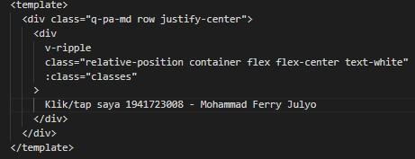
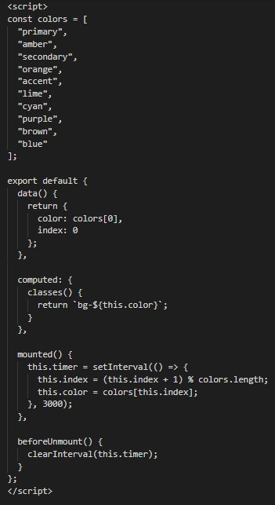
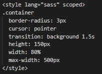
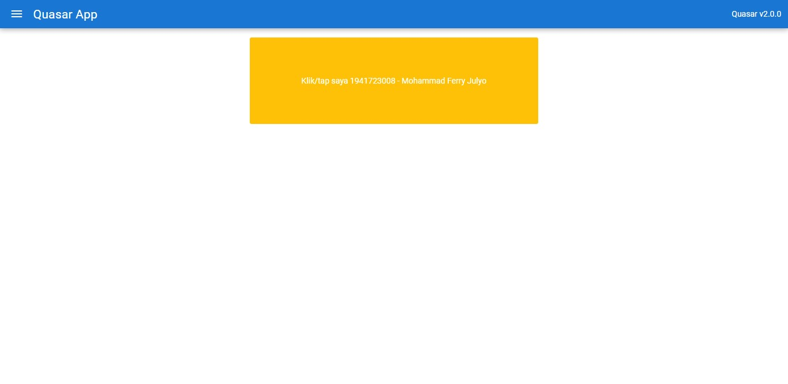
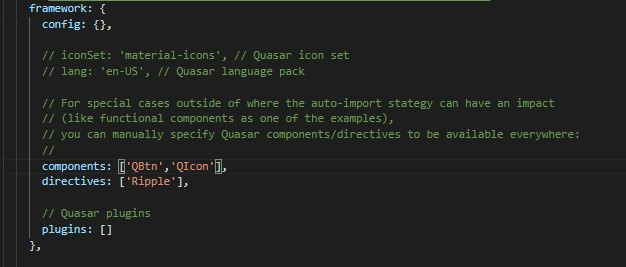
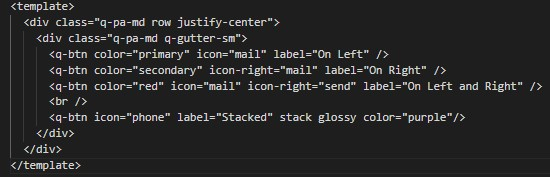
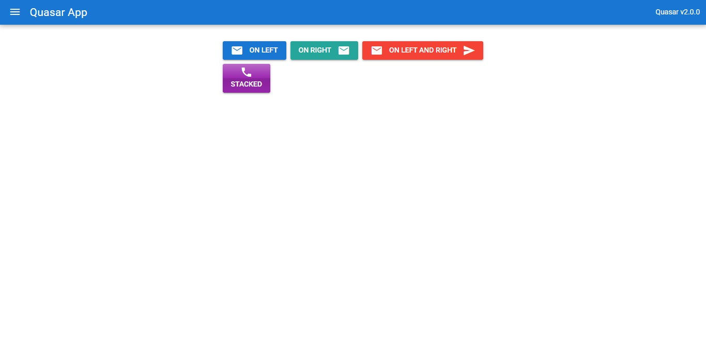
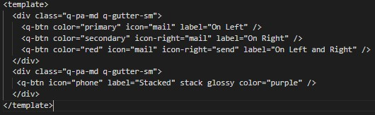
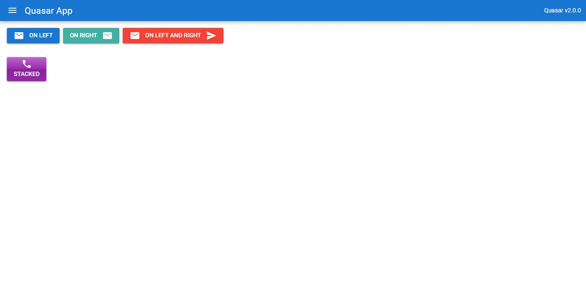

# 14 - Quasar Directives dan Components

## Tujuan Pembelajaran

1. Mahasiswa lebih memahami tentang Quasar Directives dan Components.

## Hasil Praktikum 1 : Menggunakan Quasar Directives

1. Kita buat project quasar baru atau dapat melanjutkan dari codelabs 13 sebelumnya. Jika ingin membuat project baru, maka lakukan perintah berikut pada CMD atau terminal.

<b>quasar</b> create belajar-directives-components

2. Setelah proses pembuatan project baru berhasil, selanjutnya kita definisikan directive Ripple yang akan digunakan pada file quasar.conf.js

3. Setelah itu masuk ke folder src > pages pilih file Index.vue ganti kode template seperti berikut.

4. Selanjutnya kode script seperti berikut.

5. Untuk kode style ganti seperti berikut.

6. Kemudian silakan save dan run perintah quasar dev untuk melihat hasilnya di browser. Seharusnya tampil seperti pada gambar berikut. Jika area berwarna kuning di klik/tap, maka akan ada efek Ripple.

## Hasil Praktikum 2 : Menggunakan Quasar Components

1. Pertama, sebelum kita menggunakan Button dan Icon, perlu kita definisikan komponen yang dibutuhkan pada file quasar.conf.js

2. Selanjutnya kita buat kode HTML di src > pages > Index.vue seperti berikut.

3. Save file quasar.conf.js dan Index.vue tersebut, lalu lihat hasilnya di browser. Seharusnya tampil seperti gambar berikut.

## Tugas

1. Berdasarkan praktikum 1 yang telah Anda lakukan, jelaskan maksud kode di template: class="q-pa-md row justify-center" ?

2. Berdasarkan praktikum 1 pada langkah nomor 4, jelaskan maksud script tersebut seperti kegunaan konstanta colors, fungsi data(), computed, mounted, dan beforeDestroy() !

3. Berdasarkan praktikum 2 pada langkah nomor 2, jelaskan maksud tiap kode HTML pada template yang mendefinisikan tiap button tersebut!

4. Coba ganti kode template HTML pada praktikum 2 menjadi seperti berikut. Save file, lalu perhatikan apa yang terjadi ? Mengapa terjadi demikian, jelaskan!

# Jawab

1. Maksud dari kode diatas ialah menempatkan semua konten yang ada pada class tersebut di tengah halaman web dengan rata

2. jelaskan maksud script kegunaan konstanta colors, fungsi data(), computed, mounted, dan beforeDestroy() !

    - colors : berisi list warna dalam bentuk array yang nantinya akan ditampilkan pada bagian nim-nama secara bergantian
    - fungsi data() : mengembalikan warna / colors
    - computed : properti dalam computed mengolah value yang berasal dari data, menyimpannya dalam cache dan mengembalikannya
    - mounted : fungsi yang mengatur perubahan warna sesuai interval yang diatur
    - beforeDestroy() : fungsi untuk memanggil this.timer sebelum instance dihancurkan

3.  jelaskan maksud tiap kode HTML pada template yang mendefinisikan tiap button tersebut!

    a. <q-btn color="primary" icon="mail" label="On Left" /> : color "primary" untuk mengatur warna menjadi biru, icon "mail" untuk mengambil icon email, label "On Left" untuk text pada button

    b. <q-btn color="secondary" icon-right="mail" label="On Right" /> color "secondary" untuk mengatur warna menjadi aqua, icon "mail" untuk mengambil icon email, label "On Right" untuk text pada button

    c. <q-btn color="red" icon="mail" icon-right="send" label="On Left and Right" /> color "red" untuk mengatur warna menjadi merah, icon "mail" untuk mengambil icon email, icon-right "send" untuk mengatur icon menjadi send dan diposisi bagian kanan, label "On Left and On Right" untuk text pada button

    d. <q-btn icon="phone" label="Stacked" stack glossy color="purple"/>icon "phone" untuk mengambil icon telepon, label "Stacked" untuk text pada button, stack glossy untuk memberikan efek berkilau, color "purple" untuk mengatur warna button menjadi ungu

4. Ganti Kode menjadi...

Hasilnya...

Justify center dihapus, maka posisi icon akan menjadi default(Kiri atas)

[link Index.js](../../src/11_Redux_Thunk/src/index.js)

[link App.js](../../src/11_Redux_Thunk/src/app.js)

[link Header.js](../../src/11_Redux_Thunk/src/components/Header.js)

[link routes.js](../../src/11_Redux_Thunk/src/components/routes.js)

[link Register.js](../../src/11_Redux_Thunk/src/components/Register.js)

[link Login.js](../../src/11_Redux_Thunk/src/components/Login.js)

[link auth.js(action)](../../src/11_Redux_Thunk/src/redux/action/auth.js)

[link auth.js(reducer)](../../src/11_Redux_Thunk/src/redux/reducer/auth.js)

[link index.js(reducer)](../../src/11_Redux_Thunk/src/redux/reducer/index.js)

[link configureStore.js](../../src/11_Redux_Thunk/src/redux/configureStore.js)

[link protectedRoute.js)](../../src/11_Redux_Thunk/src/redux/routes/protectedRoute.js)

